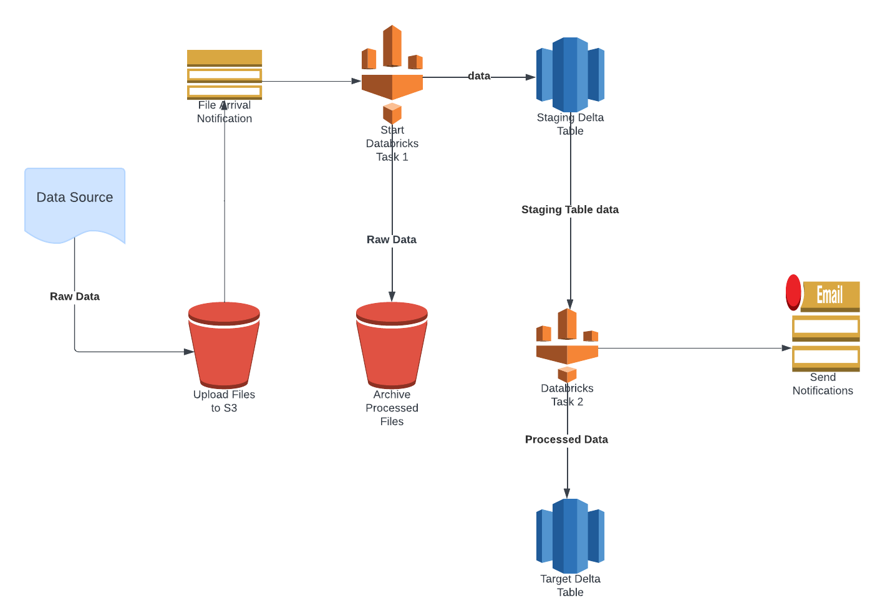

# S3 File Processing Workflow with Databricks

This project automates the process of handling files added to an S3 bucket by a source system. It involves creating a temporary Delta table, performing upsert operations, and sending notifications upon completion.

## Workflow Overview

1. **File Arrival**: The source system uploads files to a specified S3 bucket.
2. **Trigger Workflow**: An event trigger in Databricks detects the arrival of new files and initiates the workflow.
3. **Task 1**: 
   - Creates a temporary Delta table from the new file data.
   - Moves the processed file to an archive location in the S3 bucket.
4. **Task 2**: Reads data from the temporary Delta table and performs an upsert operation to the target Delta table.
5. **Completion Notification**: Once the workflow job is complete, an email notification is sent to relevant stakeholders.

### Diagram

## Prerequisites

- AWS Account
- Access to AWS S3
- Databricks Account
- Email service setup for notifications

## Setup Instructions

### 1. Configure S3 Bucket

- Create an S3 bucket for file uploads.
- Set appropriate permissions to allow Databricks to access the bucket.

### 2. Set Up Databricks Workflow

- Create a new Databricks workflow.
- Configure the file arrival trigger to initiate the workflow when new files are added to the S3 bucket.

### 3. Implement Task 1

- In Task 1, implement the following steps:
  - Create a temporary Delta table from the incoming file data.
  - Move the original file to the archive location.
  
### 4. Implement Task 2

- In Task 2, you will read data from the temporary Delta table created in Task 1 and perform an upsert operation to the target Delta table. This ensures that the latest data is reflected in your final dataset while preserving existing records.

#### Upsert Logic

1. **Read Data from Temporary Delta Table**: Use Spark to load the data from the temporary Delta table.
2. **Perform Upsert Operation**: Use the Delta Lake `MERGE` command to delete existing records in the target table and append all records.

### 5. Send Email Notification

- After the workflow completes, it's important to notify stakeholders about the successful processing of the files.
